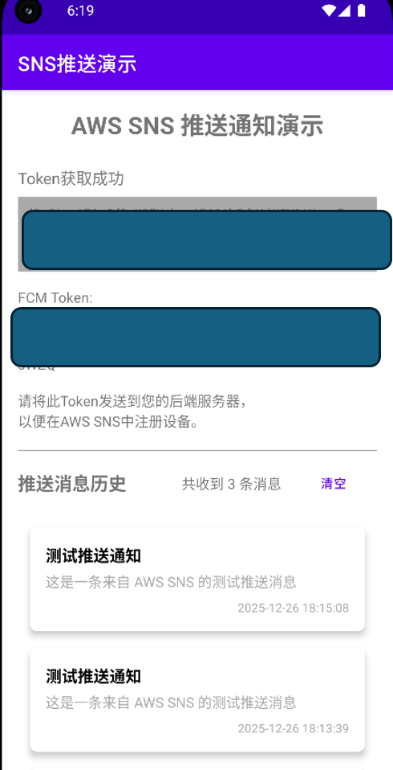
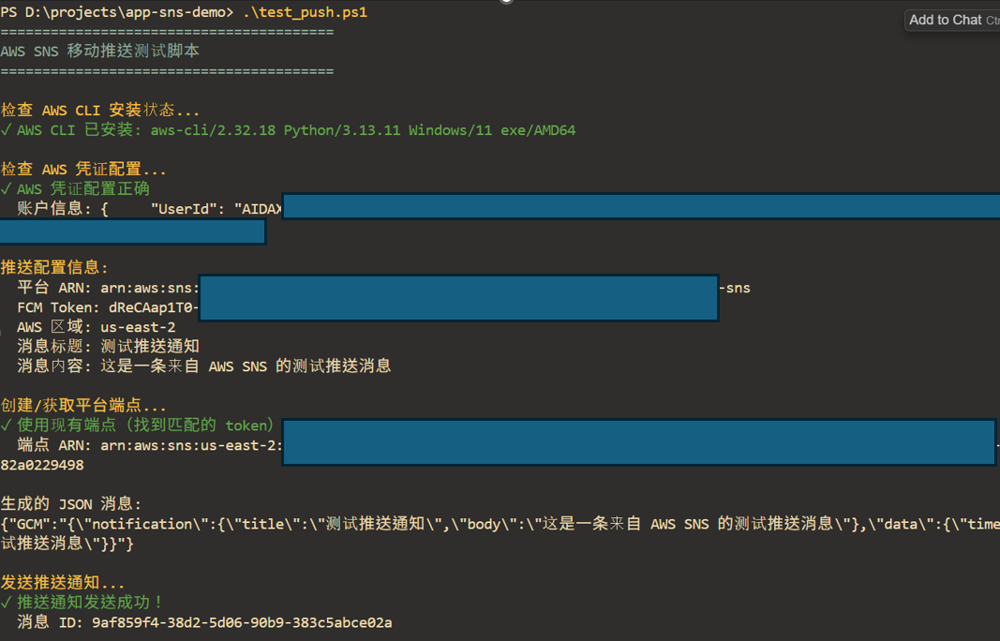

# AWS SNS 行動推送 Android 應用

這是一個Android應用範例，示範如何接收AWS SNS行動推送通知。

## 功能特性

- ✅ 整合Firebase Cloud Messaging (FCM)
- ✅ 獲取並顯示FCM註冊令牌
- ✅ 接收並顯示AWS SNS推送通知
- ✅ 處理通知點擊事件
- ✅ 支援Android 13+通知權限

## 前置要求

1. **Android Studio** (最新版本)
2. **Firebase專案** - 需要在Firebase控制台創建專案
3. **AWS帳戶** - 用於配置SNS服務
4. **Java 17** 或更高版本

## 配置步骤

### 1. Firebase配置

1. 訪問 [Firebase控制台](https://console.firebase.google.com/)
2. 創建新專案或選擇現有專案
3. 新增Android應用：
   - 包名：`com.example.snspushdemo`
   - 下載 `google-services.json` 檔案
4. 將 `google-services.json` 檔案放置到 `app/` 目錄下

### 2. AWS SNS配置

1. 登入 [AWS控制台](https://console.aws.amazon.com/)
2. 進入 **SNS (Simple Notification Service)**
3. 創建平台應用：
   - 選擇 **行動推送通知**
   - 選擇 **Android**
   - 上傳Firebase伺服器金鑰（從Firebase專案設定中獲取）
4. 創建平台端點：
   - 使用應用獲取的FCM Token
   - 保存端點ARN，用於發送推送通知

### 3. 獲取Firebase伺服器金鑰

1. 在Firebase控制台中，進入專案設定
2. 選擇 **雲端訊息傳遞** 標籤
3. 複製 **伺服器金鑰**（用於AWS SNS配置）

### 4. 建構和執行

#### 方法1：使用安裝腳本（推薦）

**Windows使用者：**
```cmd
# 直接執行安裝腳本
install_apk.bat
```

**Linux/Mac使用者：**
```bash
# 新增執行權限並執行
chmod +x install_apk.sh
./install_apk.sh
```

腳本會自動：
- 檢查設備連接
- 搜尋或建構APK
- 安裝APK到設備
- 可選擇立即啟動應用

#### 方法2：使用Gradle命令

```bash
# 建構Debug APK
./gradlew assembleDebug

# 或建構Release APK
./gradlew assembleRelease

# 直接安裝到設備（需要設備已連接）
./gradlew installDebug
```

APK檔案位置：
- Debug: `app/build/outputs/apk/debug/app-debug.apk`
- Release: `app/build/outputs/apk/release/app-release.apk`

#### 方法3：手動安裝

1. **建構APK**
   ```bash
   ./gradlew assembleDebug
   ```

2. **找到APK檔案**
   - Debug: `app/build/outputs/apk/debug/app-debug.apk`

3. **使用ADB安裝**
   ```bash
   # 檢查設備連接
   adb devices
   
   # 安裝APK
   adb install app/build/outputs/apk/debug/app-debug.apk
   
   # 或覆蓋安裝（如果已存在）
   adb install -r app/build/outputs/apk/debug/app-debug.apk
   ```

4. **啟動應用**
   ```bash
   adb shell am start -n com.example.snspushdemo/.MainActivity
   ```

#### 方法4：在Android Studio中

1. 開啟專案
2. 同步Gradle
3. 連接設備或啟動模擬器
4. 點擊 **Run** 按鈕（綠色三角形）或按 `Shift+F10`

## 使用说明

1. **獲取FCM Token**
   - 啟動應用後，點擊「獲取FCM Token」按鈕
   - Token將顯示在螢幕上
   - 應用介面範例：
     

2. **複製Token**
   - 點擊「複製Token到剪貼簿」按鈕
   - 將Token用於測試腳本或發送到您的後端伺服器

3. **發送測試推送**
   - **使用 PowerShell 腳本（Windows 推薦）**：
     ```powershell
     .\test_push.ps1 -PlatformArn "YOUR_PLATFORM_ARN" -FcmToken "YOUR_FCM_TOKEN"
     ```
   - 腳本會自動創建端點並發送推送通知
   - 發送推送範例：
     

4. **註冊設備（後端整合）**
   - 在您的後端伺服器上，使用FCM Token在AWS SNS中創建平台端點
   - 保存端點ARN以便後續發送推送

5. **接收推送**
   - 應用會自動接收來自AWS SNS的推送通知
   - 點擊通知可以開啟應用並查看詳細資訊

## 后端集成示例

您需要創建一個後端服務來：
1. 接收FCM Token
2. 在AWS SNS中創建平台端點
3. 使用端點ARN發送推送通知

### AWS SNS創建端點範例（Java/Spring Boot）

```java
@RestController
@RequestMapping("/api/device")
public class DeviceController {
    
    @Autowired
    private AmazonSNS snsClient;
    
    @PostMapping("/register")
    public ResponseEntity<String> registerDevice(@RequestBody DeviceRegistrationRequest request) {
        // 創建平台端點
        CreatePlatformEndpointRequest endpointRequest = new CreatePlatformEndpointRequest()
            .withPlatformApplicationArn("arn:aws:sns:region:account:app/GCM/your-app-arn")
            .withToken(request.getFcmToken());
        
        CreatePlatformEndpointResult result = snsClient.createPlatformEndpoint(endpointRequest);
        String endpointArn = result.getEndpointArn();
        
        return ResponseEntity.ok(endpointArn);
    }
    
    @PostMapping("/send")
    public ResponseEntity<String> sendPush(@RequestBody PushNotificationRequest request) {
        // 發送推送通知
        PublishRequest publishRequest = new PublishRequest()
            .withTargetArn(request.getEndpointArn())
            .withMessage(request.getMessage())
            .withSubject(request.getSubject());
        
        snsClient.publish(publishRequest);
        return ResponseEntity.ok("推送已發送");
    }
}
```

## 项目结构

```
app-sns-demo/
├── app/
│   ├── build.gradle
│   ├── google-services.json (需要添加)
│   └── src/
│       └── main/
│           ├── AndroidManifest.xml
│           ├── java/com/example/snspushdemo/
│           │   ├── MainActivity.kt
│           │   ├── FCMTokenManager.kt
│           │   └── service/
│           │       └── MyFirebaseMessagingService.kt
│           └── res/
│               ├── layout/
│               ├── values/
│               └── drawable/
├── image/
│   ├── push_message.png (推送訊息介面截圖)
│   └── receive.png (接收通知介面截圖)
├── build.gradle
├── settings.gradle
├── test_push.ps1 (PowerShell 推送測試腳本)
├── requirements.txt (Python 依賴)
└── README.md
```

## 注意事项

1. **安全**：不要將 `google-services.json` 提交到版本控制系統
2. **Token管理**：FCM Token可能會刷新，需要實作 `onNewToken` 回調來更新伺服器端的Token
3. **通知權限**：Android 13+需要執行時請求通知權限
4. **測試**：使用AWS SNS控制台或API發送測試推送通知

#### 使用PowerShell脚本测试（Windows）

PowerShell 腳本提供了完整的推送測試功能，支援參數化配置。

**前置要求：**
- 已安裝 AWS CLI
- 已配置 AWS 憑證（執行 `aws configure`）

**參數說明：**
- `-PlatformArn`（必需）：AWS SNS 平台應用 ARN
- `-FcmToken`（必需）：Firebase Cloud Messaging 設備令牌
- `-AwsRegion`（可選）：AWS 區域，預設：`us-east-2`
- `-MessageTitle`（可選）：推送通知標題，預設：`"測試推送通知"`
- `-MessageBody`（可選）：推送通知內容，預設：`"這是一條來自 AWS SNS 的測試推送訊息"`
- `-MessageSubject`（可選）：訊息主題，預設：`"SNS 推送測試"`

**功能特性：**
- ✅ 自動檢查 AWS CLI 安裝和配置
- ✅ 自動創建或搜尋現有端點
- ✅ 端點已存在時自動跳過創建
- ✅ 完整的錯誤處理和驗證
- ✅ 支援自訂推送訊息內容

**查看幫助：**
```powershell
Get-Help .\test_push.ps1 -Full
```

#### 使用Python腳本測試
```bash
# 安裝依賴
pip install -r requirements.txt

# 創建端點並發送推送
python test_push.py \
  --platform-arn "arn:aws:sns:us-east-1:123456789012:app/GCM/MyApp" \
  --token "YOUR_FCM_TOKEN" \
  --title "測試標題" \
  --body "測試訊息"
```

## 應用介面展示

### 發送推送訊息

使用 PowerShell 腳本發送推送通知：


### 接收推送通知

應用接收並顯示推送通知：


## 故障排除

### Token獲取失敗
- 檢查網路連接
- 確認 `google-services.json` 檔案已正確放置
- 檢查包名是否匹配

### 收不到推送通知
- 確認設備已連接到網際網路
- 檢查通知權限是否已授予
- 驗證AWS SNS端點ARN是否正確
- 查看Logcat日誌獲取詳細錯誤資訊
- 參考 [TESTING_GUIDE.md](TESTING_GUIDE.md) 進行除錯

## 许可证

MIT License

## 参考资源

- [AWS SNS行動推送文件](https://docs.aws.amazon.com/sns/latest/dg/mobile-push-notifications.html)
- [Firebase Cloud Messaging文件](https://firebase.google.com/docs/cloud-messaging)
- [Android通知指南](https://developer.android.com/develop/ui/views/notifications)

